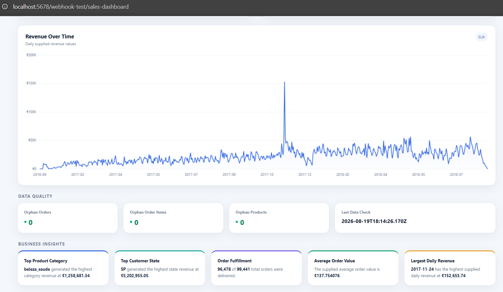
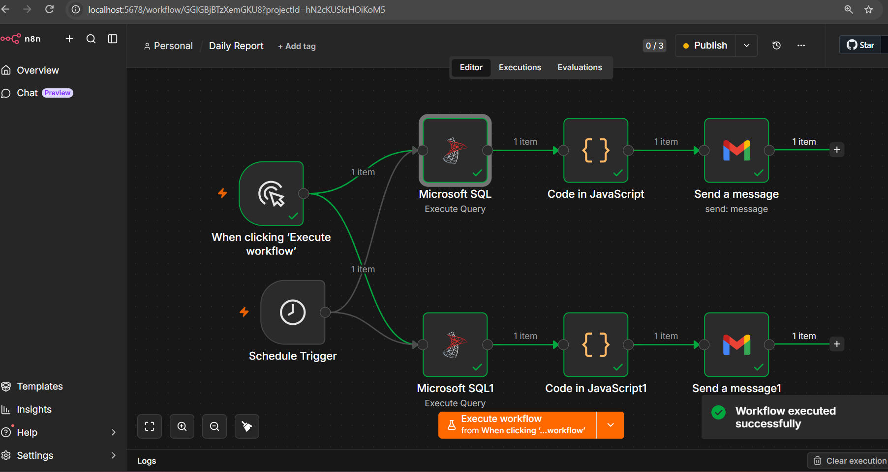
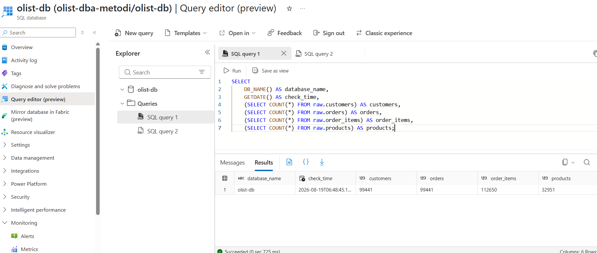
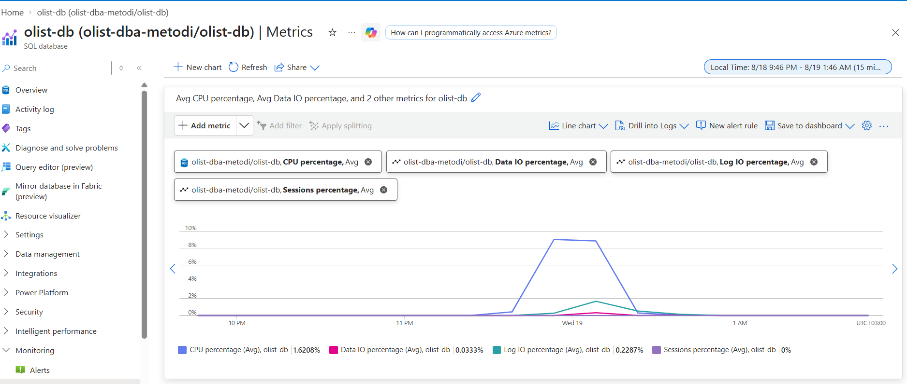
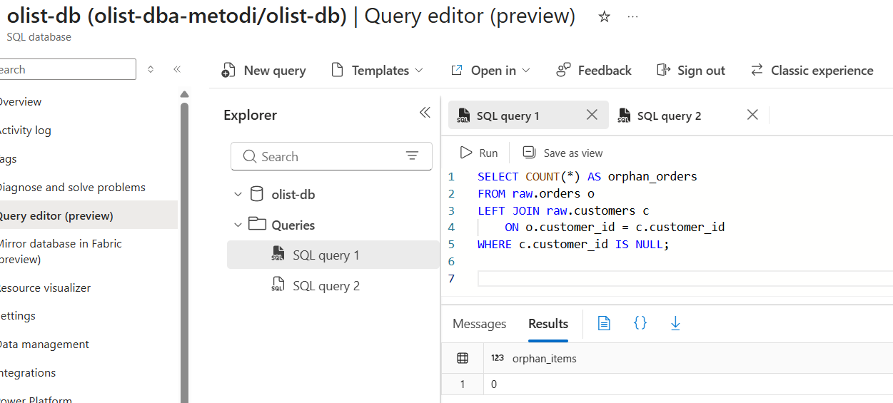
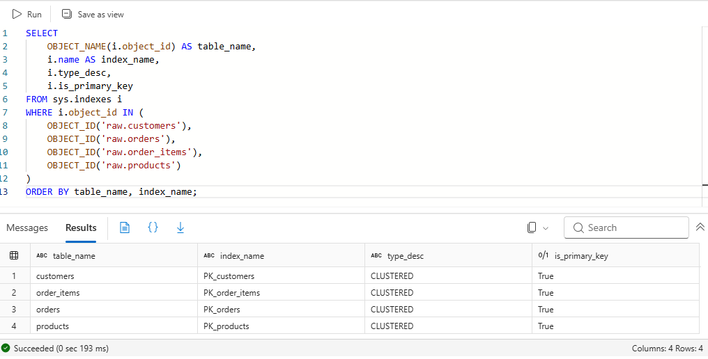
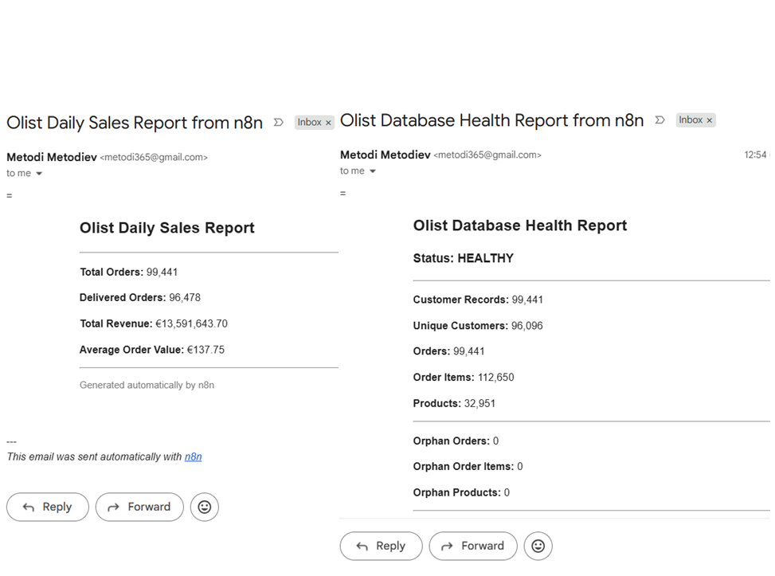
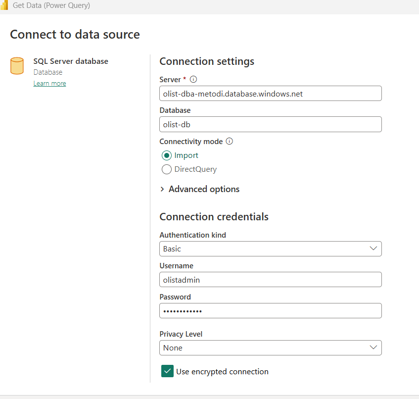
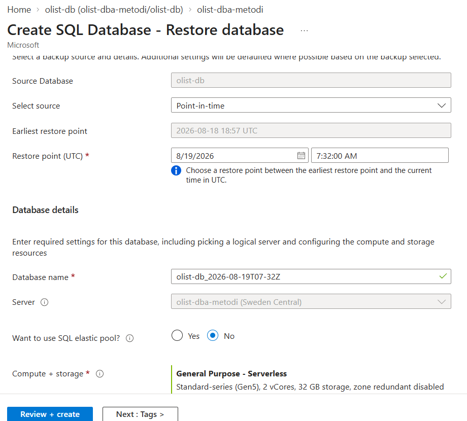
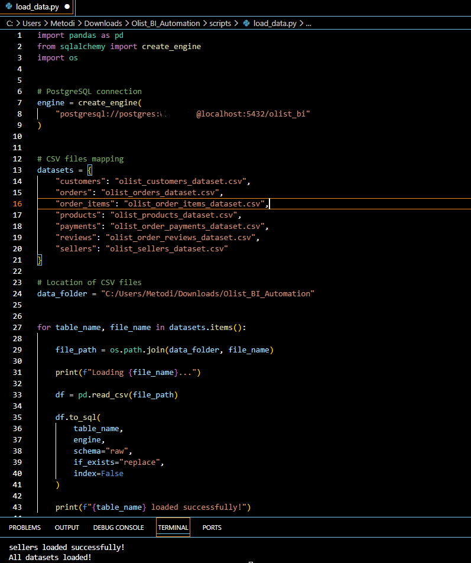

# AI-Powered Sales Analytics Dashboard

An automated **data-to-dashboard pipeline** built around **SQL, n8n, AI and Chart.js**.

The project demonstrates how analytical data can be transformed into a business-oriented executive dashboard through a controlled workflow that combines data extraction, SQL analysis, validation, AI-generated dashboard design and automated HTML generation.

---

## 📊 Dashboard Preview

### Sales & Orders Executive Dashboard

### Orders & Revenue View

### QA & BI View

The generated dashboard combines KPI summaries, revenue analysis, order status, product/category performance, customer geography, time trends, data-quality indicators and business insights.

---

# 🎯 Project Goal

The goal was to build an automated pipeline that transforms raw analytical data into a usable business dashboard with minimal manual dashboard development.

Instead of manually preparing datasets and designing every visualization, the workflow automates the process:

**Data → SQL Analysis → Validation → AI Specification → Controlled Generation → Dashboard**

This project focuses on the integration between **data engineering, analytics, workflow automation and generative AI**.

---

# 🏗️ Solution Architecture

The overall workflow is implemented as an n8n orchestration pipeline.

~~~
                         ┌─────────────────────┐
                         │      Azure SQL      │
                         │                     │
                         │  Analytical Data    │
                         └──────────┬──────────┘
                                    │
                                    ▼
                         ┌─────────────────────┐
                         │     SQL Queries     │
                         │                     │
                         │ KPI / Trend /       │
                         │ Category / Geo Data │
                         └──────────┬──────────┘
                                    │
                                    ▼
                         ┌─────────────────────┐
                         │        n8n          │
                         │                     │
                         │ Data Processing     │
                         │ Data Assembly       │
                         └──────────┬──────────┘
                                    │
                                    ▼
                         ┌─────────────────────┐
                         │ Validation & QA     │
                         │                     │
                         │ Dataset checks      │
                         │ Structure checks    │
                         └──────────┬──────────┘
                                    │
                                    ▼
                         ┌─────────────────────┐
                         │       AI #1         │
                         │                     │
                         │ Dashboard           │
                         │ Specification       │
                         └──────────┬──────────┘
                                    │
                                    ▼
                         ┌─────────────────────┐
                         │ Specification       │
                         │ Parsing / Assembly   │
                         └──────────┬──────────┘
                                    │
                     ┌──────────────┴──────────────┐
                     │                             │
                     ▼                             ▼
             Actual Datasets              AI Dashboard Spec
                     │                             │
                     └──────────────┬──────────────┘
                                    ▼
                         ┌─────────────────────┐
                         │       AI #2         │
                         │                     │
                         │ Dashboard Generator │
                         └──────────┬──────────┘
                                    │
                                    ▼
                         ┌─────────────────────┐
                         │ HTML + CSS + JS     │
                         │                     │
                         │ Chart.js            │
                         └──────────┬──────────┘
                                    │
                                    ▼
                         ┌─────────────────────┐
                         │ Generated Executive │
                         │ Dashboard           │
                         └──────────┬──────────┘
                                    │
                                    ▼
                         ┌─────────────────────┐
                         │       Webhook       │
                         └─────────────────────┘
~~~

### n8n implementation

---

# 🔄 Workflow

The workflow is divided into several logical stages.

## 1. Data Extraction

The pipeline starts from analytical data stored in the SQL environment.

SQL queries are used to prepare separate datasets for different dashboard components rather than sending an entire database directly to the AI model.

Typical analytical outputs include:

- KPI datasets
- Revenue datasets
- Order-status datasets
- Product/category datasets
- Customer/geographic datasets
- Time-series datasets
- Data-quality results

---

## 2. Data Processing & Assembly

The n8n workflow combines the individual query results into a structured analytical payload.

The processing stage is responsible for:

- Combining query outputs
- Structuring datasets
- Preparing consistent field names
- Separating datasets by analytical purpose
- Passing the correct data to the following AI stages

The purpose is to create a predictable input for AI rather than relying on the model to discover the data structure itself.

---

## 3. Data Validation

Validation is performed before dashboard generation.

The project includes checks for data integrity and relationship consistency, including orphan-record checks.

The generated dashboard exposes data-quality indicators such as:

- Orphan Orders
- Orphan Order Items
- Orphan Products
- Last Data Check

Example:

This creates a controlled flow:

**Extract → Process → Validate → Generate**

rather than:

**Extract → Ask AI to figure everything out**

---

# 🤖 AI Architecture

The project uses **two separate AI stages**.

## AI #1 — Dashboard Specification

The first AI stage receives the available analytical datasets and generates a structured dashboard specification.

Its role is to determine:

- Dashboard structure
- Relevant KPIs
- Suitable visualizations
- Analytical sections
- Data relationships required for visualization
- Business-oriented presentation of the supplied data

The first AI is therefore used as a **dashboard planning layer** rather than directly generating the final HTML.

Conceptually:

~~~
Analytical Datasets
        ↓
      AI #1
        ↓
Dashboard Specification
~~~

---

## AI #2 — Dashboard Generation

The second AI stage receives:

1. The generated dashboard specification
2. The actual analytical datasets

It then generates the final dashboard implementation.

The output contains:

- HTML
- CSS
- JavaScript
- Chart.js visualizations
- KPI cards
- Charts
- Data-quality sections
- Business insight sections

Conceptually:

~~~
Dashboard Specification
          +
Actual Analytical Data
          ↓
        AI #2
          ↓
HTML + CSS + JavaScript
          ↓
Chart.js Dashboard
~~~

This separation makes the workflow easier to control and reduces the need for a single AI step to perform data interpretation, dashboard planning and front-end generation simultaneously.

---

# 📈 Business Metrics

The generated dashboard works with business-oriented sales metrics such as:

| KPI | Purpose |
|---|---|
| Total Revenue | Overall sales value |
| Total Orders | Number of distinct orders |
| Average Order Value | Average value per order |
| Delivered Orders | Fulfillment performance |
| Unique Customers | Customer volume |
| Order Items | Sales item volume |

The dashboard also supports analytical dimensions such as:

- Product category
- Customer state
- Order status
- Order date
- Revenue over time

---

# 📊 Dashboard Analytics

## Revenue by Product Category

The dashboard ranks product categories by revenue and presents them as a visual comparison.

This makes it possible to identify the categories contributing the largest share of sales in the supplied dataset.

---

## Orders by Status

Order status is presented separately to provide visibility into the order lifecycle.

Examples include:

- Delivered
- Shipped
- Canceled
- Unavailable
- Invoiced
- Processing
- Created
- Approved

The dashboard uses the actual supplied values rather than asking the AI to invent status counts.

---

## Revenue by Customer Geography

Revenue can be analyzed by customer state.

This provides a geographic view of the sales distribution and allows the dashboard to highlight the states with the largest supplied revenue values.

---

## Revenue Trend

The project also generates a time-series visualization showing revenue over the supplied analytical period.

The generated dashboard uses a Chart.js line chart for the trend analysis.

---

# 💡 Business Insights

The final dashboard can include business observations derived from the supplied datasets.

Examples from the generated dashboard include:

- Highest-revenue product category
- Highest-revenue customer state
- Delivered-order volume
- Average order value
- Highest observed daily revenue

The important design principle is that these observations are derived from the provided analytical data.

The AI is not intended to independently invent KPI values or business facts.

---

# 🧠 Data-to-AI Guardrail

A key part of the architecture is the separation between **data preparation** and **AI generation**.

The intended flow is:

~~~
Actual Data
    ↓
SQL Analysis
    ↓
Validation
    ↓
Structured Dataset
    ↓
AI Specification
    ↓
Actual Dataset + Specification
    ↓
AI Dashboard Generation
~~~

This allows the AI to focus on:

- Interpretation
- Dashboard structure
- Visualization selection
- Presentation
- HTML/CSS/JavaScript generation

while the underlying business values originate from the supplied analytical datasets.

---

# 🗄️ Analytical Data Model

The project uses an Olist e-commerce dataset.

The analytical model includes dimensional and fact-style structures such as:

~~~
dim_customer
    │
    └── customer_unique_id
        customer_city
        customer_state

dim_product
    │
    └── product_id
        product_category_name
        product dimensions

dim_date
    │
    └── date
        year
        month
        quarter

fact_sales
    │
    ├── order_id
    ├── order_date
    ├── customer_id
    ├── product_id
    ├── seller_id
    ├── price
    ├── freight_value
    ├── payment_value
    └── customer_unique_id
~~~

Additional analytical structures include:

- \`kpi_sales\`
- \`monthly_sales\`
- \`product_performance\`
- \`customer_performance\`

The SQL model includes calculations for:

- Revenue
- Orders
- Customers
- Average order value
- Monthly revenue
- Revenue growth
- Product performance
- Customer performance
- Profit

---

# 🛡️ Data Quality & Monitoring

The repository contains supporting material for data-quality and operational checks.

### Validation

### Monitoring

### Orphan Check

The dashboard also surfaces validation information directly to the end user.

---

# ⚙️ Automation & Supporting Components

The repository contains supporting screenshots and assets covering several parts of the analytical workflow.

### Performance

### Automated Emails

### Power BI Server

### Point-in-Time Restore

### Python Data Import

These assets document the broader data/BI environment around the project in addition to the generated dashboard itself.

---

# 🧩 Repository Structure

~~~
AI-sales-dashboard/
│
├── Olist_Data_files/
│   ├── olist_customers_dataset.csv
│   ├── olist_orders_dataset.csv
│   ├── olist_order_items_dataset.csv
│   ├── olist_order_payments_dataset.csv
│   ├── olist_order_reviews_dataset.csv
│   ├── olist_products_dataset.csv
│   ├── olist_sellers_dataset.csv
│   ├── product_category_name_translation.csv
│   ├── load_customers.py
│   └── schema.txt
│
├── screenshots/
│   ├── n8n_AI_architecture.png
│   ├── n8n_workflow.png
│   ├── Dashboard_Sales.png
│   ├── Dash_orders_revenue.png
│   ├── Dashboard_QA&BI.png
│   ├── Dataset_validation.png
│   ├── Monitoring.png
│   ├── orphan_check.png
│   ├── Performance_demo.png
│   ├── automated_emails_received.png
│   ├── Power_BI_Server.png
│   ├── Restore_point_in_time.png
│   └── py_import.png
│
├── index.html
└── readme.md
~~~

---

# 🛠️ Technology Stack

| Area | Technology |
|---|---|
| Database / SQL | Azure SQL / SQL |
| Workflow Automation | n8n |
| AI | Generative AI / AI workflow nodes |
| Dashboard | HTML, CSS, JavaScript |
| Visualization | Chart.js |
| Data Processing | SQL, n8n, Python support |
| Data Source | Olist e-commerce dataset |
| Integration | Webhooks |
| BI | Power BI assets / supporting analytics |

---

# 📌 What This Project Demonstrates

This project demonstrates practical experience across several areas.

### Data

- SQL-based analytical data preparation
- Fact/dimension-style modeling
- KPI calculation
- Time-series analysis
- Customer and product analytics

### Data Quality

- Dataset validation
- Orphan-record detection
- Data-quality indicators
- Validation before AI generation

### Automation

- n8n workflow orchestration
- Multi-step data processing
- Dataset assembly
- Webhook-based delivery

### AI

- AI-assisted dashboard specification
- Separate AI generation stage
- Structured AI inputs
- Data-grounded dashboard generation

### BI & Visualization

- Executive KPI design
- Revenue analysis
- Order analysis
- Geographic analysis
- Chart.js dashboard generation

### Front-End

- HTML
- CSS
- JavaScript
- Responsive dashboard layout
- Chart.js visualizations

---

# 🔗 End-to-End Flow

The complete concept can be summarized as:

~~~
                    RAW / ANALYTICAL DATA
                              │
                              ▼
                         SQL QUERIES
                              │
                              ▼
                       n8n PROCESSING
                              │
                              ▼
                    DATA VALIDATION / QA
                              │
                              ▼
                       DATASET ASSEMBLY
                              │
                              ▼
                    ┌──────────────────┐
                    │      AI #1       │
                    │ Dashboard Design │
                    └────────┬─────────┘
                             │
                             ▼
                    DASHBOARD SPECIFICATION
                             │
                             ▼
                  ACTUAL DATA + SPECIFICATION
                             │
                             ▼
                    ┌──────────────────┐
                    │      AI #2       │
                    │ Dashboard Builder│
                    └────────┬─────────┘
                             │
                             ▼
                     HTML / CSS / JS
                             │
                             ▼
                         Chart.js
                             │
                             ▼
                    EXECUTIVE DASHBOARD
                             │
                             ▼
                          WEBHOOK
~~~

---

# 🚀 Portfolio Value

This project is designed to demonstrate more than dashboard building.

It shows an end-to-end approach to a modern analytics workflow:

**Data → SQL → Validation → Automation → AI → Visualization**

The key idea is to combine traditional data and BI practices with AI and workflow automation, while keeping the actual analytical data as the source for the generated dashboard.

---

## 📁 Related Project

[Back to the main IT, Data & AI portfolio](../README.md)
