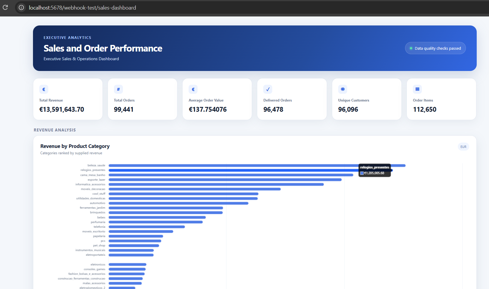
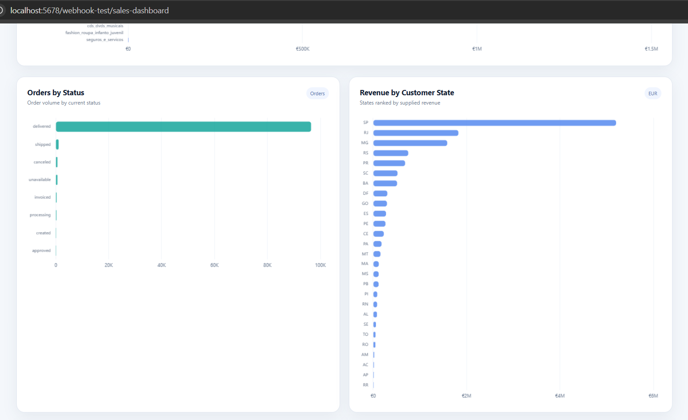
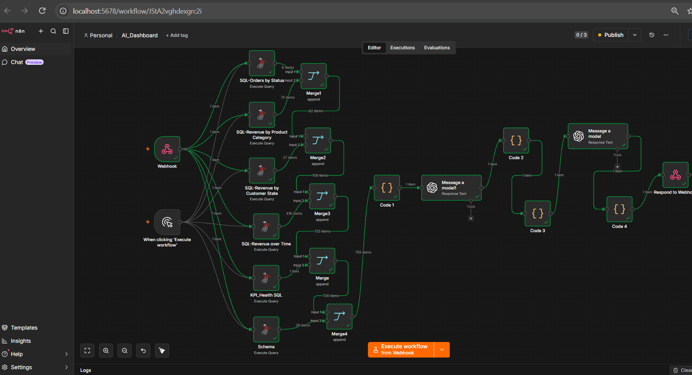

# AI-Powered Sales Analytics Dashboard

An automated data-to-dashboard pipeline built with **n8n, Azure SQL, SQL, AI and Chart.js**.

The project extracts validated business data from Azure SQL, processes and structures the data through an n8n workflow, uses AI to generate a dashboard specification, and then generates a professional executive analytics dashboard in HTML.

---

##  Dashboard Preview




The dashboard provides an executive view of sales and order performance, including KPIs, revenue analysis, order status, customer geography, time trends and data quality indicators.

---

##  Project Goal

The goal of this project was to build an automated pipeline that transforms raw analytical data into a business-oriented dashboard with minimal manual intervention.

Instead of manually preparing the data and building the dashboard, the workflow automates the process:

**Data → SQL Analysis → Validation → AI Analysis → Dashboard Generation**

---

##  Architecture

```text
                    ┌─────────────────┐
                    │    Azure SQL    │
                    │                 │
                    │ Olist Dataset   │
                    └────────┬────────┘
                             │
                             ▼
                    ┌─────────────────┐
                    │       n8n       │
                    │                 │
                    │ SQL Queries     │
                    │ Data Processing │
                    └────────┬────────┘
                             │
                             ▼
                    ┌─────────────────┐
                    │    Code Nodes   │
                    │                 │
                    │ Data Validation │
                    │ Data Structuring│
                    └────────┬────────┘
                             │
                             ▼
                    ┌─────────────────┐
                    │      AI #1      │
                    │                 │
                    │ Dashboard       │
                    │ Specification   │
                    └────────┬────────┘
                             │
                             ▼
                    ┌─────────────────┐
                    │      AI #2      │
                    │                 │
                    │ HTML Dashboard  │
                    │ Generation      │
                    └────────┬────────┘
                             │
                             ▼
                    ┌─────────────────┐
                    │ Webhook Response│
                    │                 │
                    │ Final Dashboard │
                    └─────────────────┘
```

