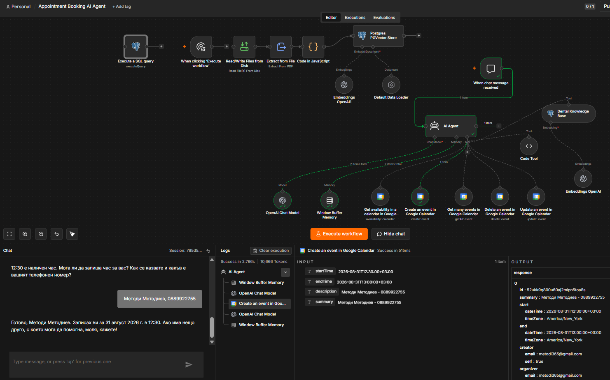
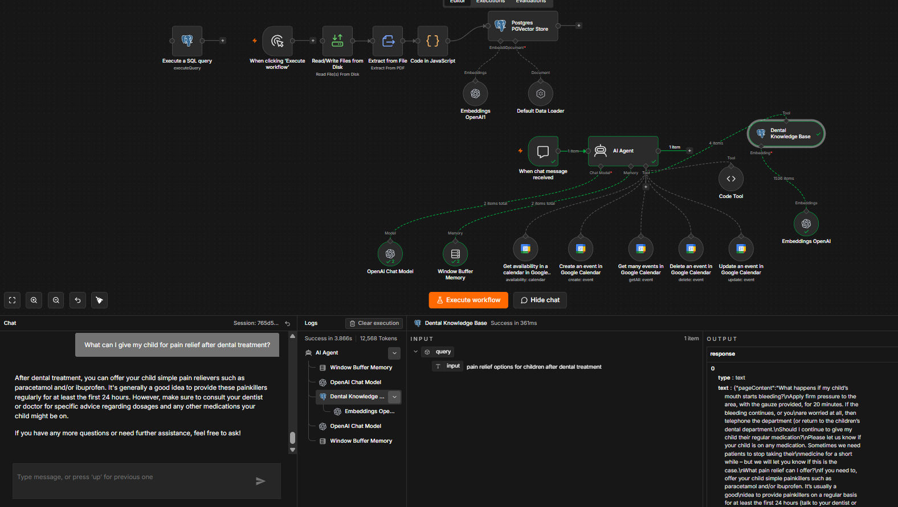
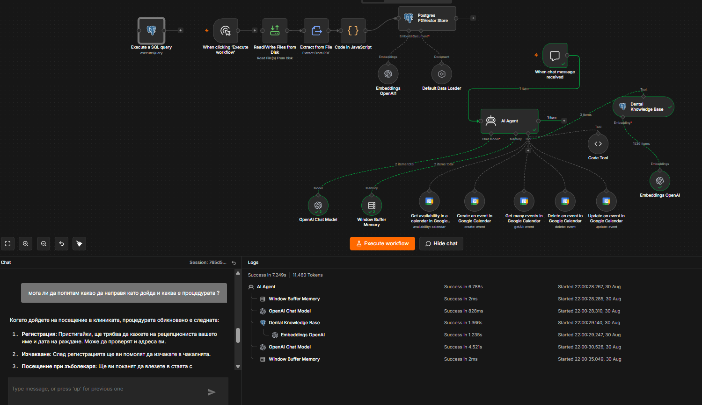
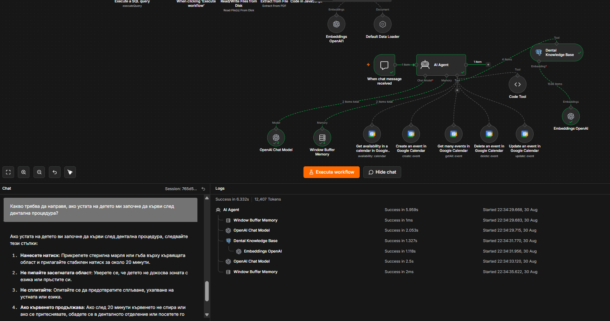
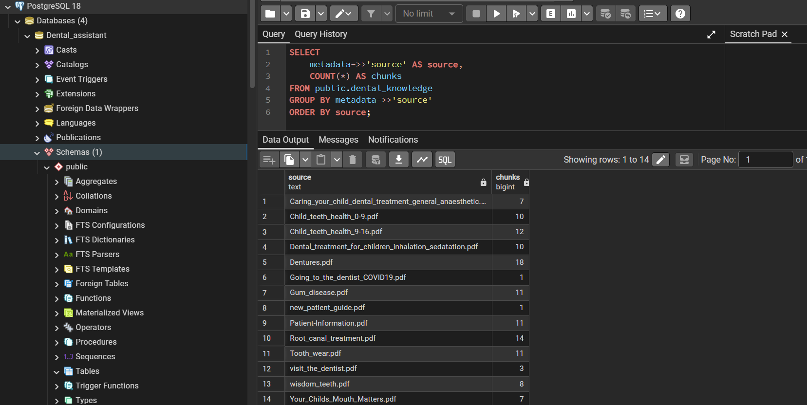

#  Dental AI Receptionist 

An AI-powered dental reception assistant built with **n8n**, **RAG**, **PostgreSQL/pgvector**, **LLM tools**, and **Google Calendar**.

The assistant can answer dental information questions using a document-based knowledge base, check appointment availability, and manage calendar appointments through a conversational interface.

---
##  Project Overview

This project demonstrates how an AI agent can automate common dental receptionist tasks while using a controlled knowledge base for clinic-related information.

The system combines:

* AI Agent orchestration
* Retrieval-Augmented Generation (RAG)
* PostgreSQL with pgvector
* Document ingestion and chunking
* Embeddings and semantic search
* Google Calendar integration
* Conversation memory
* JavaScript date processing
* Appointment availability and booking workflows

The project was built as a practical **AI automation / RAG application using n8n**.

 ## Demo

[▶️ Watch the Dental AI Receptionist Demo](demo/n8n.mp4)

---

##  Features

###  Dental Knowledge Base

The assistant uses a RAG pipeline to retrieve relevant information from dental documents before generating an answer.

The knowledge base contains multiple PDF documents covering topics such as:

* Dental visits
* Children's dental health
* Dental treatment
* Sedation
* General anaesthetic procedures
* Patient information and aftercare

Documents are extracted, split into smaller chunks, embedded, and stored in PostgreSQL using pgvector.

---

###  RAG / Semantic Search

The RAG pipeline follows this process:

```text
PDF Documents
      ↓
Read Files from Disk
      ↓
Extract from File
      ↓
JavaScript Chunking
      ↓
Document Metadata
      ↓
Embeddings
      ↓
PostgreSQL + pgvector
      ↓
Vector Search
      ↓
AI Agent
```

Each document is split into overlapping chunks to improve retrieval quality.

The chunks contain metadata identifying their original PDF source.

Example:

```json
{
  "source": "Caring_your_child_dental_treatment_general_anaesthetic.pdf"
}
```

This allows retrieved information to be traced back to the source document.

---

##  Appointment Management

The AI agent is connected to Google Calendar tools for appointment management.

The workflow supports:

* Checking appointment availability
* Checking availability for a specific date
* Checking a requested time
* Creating appointments
* Retrieving existing appointments
* Cancelling appointments
* Rescheduling appointments

Before creating an appointment, the assistant collects the required patient information such as:

* Patient name
* Phone number
* Requested date
* Requested time

The patient's name and phone number are used when creating the calendar event.

---

##  Date & Time Handling

Date interpretation is handled through a dedicated JavaScript Date Calculator tool.

The system supports natural language date expressions such as:

```text
today
tomorrow
next Monday
Friday
утре
следващия понеделник
петък
12 септември
12.09.2026
```

The date calculator resolves the requested date using the **Europe/Sofia** timezone and returns standardized ISO 8601 timestamps.

Example:

```text
2026-09-07T09:00:00+03:00
2026-09-07T17:00:00+03:00
```

This prevents the AI agent from manually calculating calendar dates and reduces date-related errors.

---

##  Architecture

```text
                         ┌──────────────────────┐
                         │        User          │
                         └──────────┬───────────┘
                                    │
                                    ▼
                         ┌──────────────────────┐
                         │      AI Agent        │
                         └──────────┬───────────┘
                                    │
                ┌───────────────────┼───────────────────┐
                │                   │                   │
                ▼                   ▼                   ▼
       ┌────────────────┐  ┌────────────────┐  ┌─────────────────┐
       │ Dental RAG     │  │ Date Calculator │  │ Google Calendar │
       │ Knowledge Base │  │                │  │                 │
       └───────┬────────┘  └────────────────┘  └────────┬────────┘
               │                                         │
               ▼                                         ▼
       ┌────────────────┐                    ┌────────────────────┐
       │ PostgreSQL     │                    │ Availability       │
       │ + pgvector     │                    │ Booking            │
       └────────────────┘                    │ Cancellation       │
                                              │ Rescheduling       │
                                              └────────────────────┘
```

---

##  Vector Database

The RAG knowledge base is stored in PostgreSQL.

Main table:

```text
public.dental_knowledge
```

The table contains the document chunks, embeddings, and metadata required for semantic retrieval.

Example structure:

```text
dental_knowledge
├── id
├── content
├── embedding
└── metadata
```

The `metadata` field stores information about the original document.

---

##  Document Ingestion

The ingestion workflow processes multiple PDF files.

Example:

```text
PDF
 ↓
Extract text
 ↓
Split into chunks
 ↓
Add metadata
 ↓
Generate embeddings
 ↓
Store in pgvector
```

The chunking logic uses:

* Chunk size: 2000 characters
* Overlap: 200 characters

The overlap helps preserve context between neighboring chunks.

---

##  Conversation Memory

The AI Agent uses conversation memory to maintain context during a conversation.

This allows users to interact naturally across multiple messages instead of providing all information again in every message.

For example:

```text
User: Do you have an appointment tomorrow?

Agent: Yes, there are available times.

User: At 13:00?

Agent: 13:00 is available.

User: Book it.

Agent: Please provide your name and phone number.
```

The conversation context allows the agent to understand that "it" refers to the previously discussed appointment.

---

##  Example RAG Interaction

**User:**

> What should I do if my child's mouth starts bleeding after dental treatment?

The RAG system retrieves relevant information from the dental knowledge base.

Example retrieved source:

```text
Caring_your_child_dental_treatment_general_anaesthetic.pdf
```

The AI Agent then generates the response using the retrieved document content.

---

##  Tech Stack

| Technology      | Purpose                                  |
| --------------- | ---------------------------------------- |
| n8n             | Workflow automation and AI orchestration |
| AI Agent        | Conversational decision making           |
| PostgreSQL      | Vector database                          |
| pgvector        | Vector similarity search                 |
| Embeddings      | Semantic document representation         |
| JavaScript      | Date processing and document chunking    |
| Google Calendar | Appointment management                   |
| RAG             | Knowledge retrieval                      |
| PDF documents   | Dental knowledge source                  |

---

##  Repository Structure

```text
dental-ai-receptionist/
│
├── README.md
│
├── workflow/
│   └── dental-ai-receptionist.json
│
├── database/
│   ├── postgresql-schema.png
│   └── rag-sources.png
│
└── screenshots/
    ├── n8n-workflow.png
    ├── rag-retrieval.png
    └── booking.png
```

---

##  Screenshots

### n8n Workflow & Appointment Booking



###  RAG Retrieval





### PostgreSQL / pgvector


### RAG Document Sources




---

##  Security

No real credentials, API keys, passwords, or private patient information are included in this repository.

The exported n8n workflow should be configured with the required credentials locally.

The included screenshots and examples use demonstration data only.

---

##  Setup

### 1. Install n8n

Run n8n locally or use an n8n instance.

### 2. Configure PostgreSQL

Create a PostgreSQL database with the pgvector extension enabled.

### 3. Import the workflow

Import:

```text
workflow/dental-ai-receptionist.json
```

into n8n.

### 4. Configure credentials

Connect the required:

* LLM provider
* PostgreSQL database
* Google Calendar

credentials.

### 5. Configure the knowledge base

Add the required dental documents to the document ingestion workflow and run the ingestion process.

### 6. Start the AI Agent

The assistant can then be used to answer knowledge-base questions and manage appointments.

---

##  Future Improvements

Potential improvements include:

* More robust appointment validation
* Improved conflict handling
* Automatic appointment reminders
* Patient database integration
* Better source citation in responses
* Multi-language support improvements
* Additional dental knowledge documents
* More advanced patient identification
* Production deployment
* Monitoring and logging

---

##  About the Project

This project was created as a practical demonstration of building an **AI-powered automation system using n8n**, combining RAG, vector databases, APIs, workflow automation, and conversational AI.

The goal was to build a system that goes beyond a simple chatbot by allowing the AI agent to interact with external systems and perform real-world tasks.

