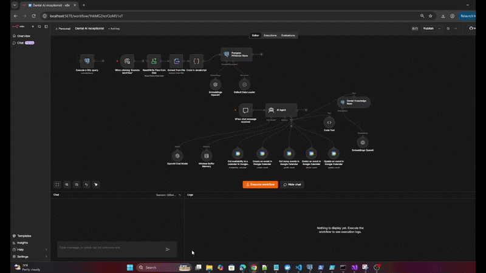
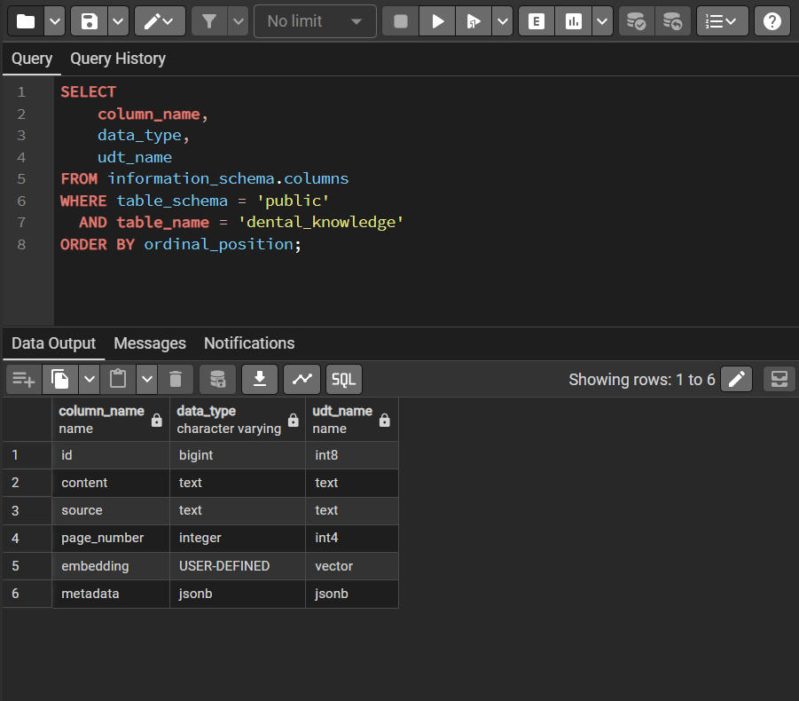

# 🦷 Dental AI Receptionist

> **Live website:** [🌐 Boyanova Dent](https://boyanova-dent.vercel.app/)

An AI-powered virtual dental receptionist built for **Boyanova Dent**, combining conversational AI, RAG, PostgreSQL/pgvector, n8n workflow automation and Google Calendar.

The project includes both the **AI receptionist backend/workflow** and a modern web interface built with **Next.js**, developed in **Visual Studio Code** and deployed with **Vercel**.

It is designed to handle common dental receptionist tasks through a natural-language chat interface — answering general dental questions, checking appointment availability and assisting with appointment management.

> **Project type:** AI Automation / RAG / Conversational AI / Workflow Automation / Full-Stack Web Application

---

## 🚀 Project Overview

The Dental AI Receptionist goes beyond a traditional chatbot.

It combines:

- 🤖 AI Agent orchestration
- 📚 Retrieval-Augmented Generation (RAG)
- 🧠 Semantic search with embeddings
- 🗄️ PostgreSQL + pgvector
- 📅 Google Calendar integration
- 🕒 Natural-language date and time handling
- 💬 Conversation memory
- 🔄 n8n workflow automation
- 🌐 Next.js web application
- ☁️ Vercel deployment
- 📰 Automated dental news aggregation

The system is designed as a practical digital receptionist for a dental practice, with the website, AI workflow and automated content pipeline working together.

---

## 🌐 Website & Frontend

The public-facing website was built from scratch using **Next.js** and **React**, with the project developed in **Visual Studio Code** and deployed through **Vercel**.

### Website

**[🌐 Visit Boyanova Dent](https://boyanova-dent.vercel.app/)**

The website includes:

- Home page
- Mission section
- Dental services
- Contact information
- AI chat assistant
- 📰 **News section**
- Responsive design for desktop and mobile

The frontend communicates with the n8n AI workflow through a webhook API.

---

## 📰 Automated Dental News Section

The website includes a dedicated **News** section powered by an additional n8n automation workflow.

Instead of manually adding articles, the workflow automatically:

1. Collects news from configured sources.
2. Processes the retrieved content.
3. Filters the information for **dental-related topics**.
4. Extracts and structures the relevant articles.
5. Publishes the selected dental news to the website.

This creates an automated content pipeline where the website can continuously receive relevant dental news without requiring manual article creation.

~~~text
News Sources
     ↓
n8n Workflow
     ↓
Content Extraction
     ↓
Dental Topic Filtering
     ↓
Article Processing
     ↓
Website News Section
~~~

This is separate from the dental RAG knowledge base: the RAG system is used for the AI receptionist's knowledge retrieval, while the news workflow provides fresh dental-related content for the public website.

---

## 🏗️ AI Receptionist Architecture

~~~text
                    ┌──────────────────────┐
                    │        Patient       │
                    │      / Website       │
                    └──────────┬───────────┘
                               │
                               ▼
                    ┌──────────────────────┐
                    │      Next.js Chat    │
                    │     Web Interface    │
                    └──────────┬───────────┘
                               │
                               ▼
                    ┌──────────────────────┐
                    │     n8n Webhook      │
                    └──────────┬───────────┘
                               │
                               ▼
                    ┌──────────────────────┐
                    │       AI Agent       │
                    └──────────┬───────────┘
                               │
             ┌─────────────────┼─────────────────┐
             │                 │                 │
             ▼                 ▼                 ▼
      ┌──────────────┐  ┌──────────────┐  ┌────────────────┐
      │   Dental RAG │  │ Date & Time  │  │ Google Calendar│
      │  Knowledge   │  │  Calculator  │  │     Tools      │
      └──────┬───────┘  └──────────────┘  └───────┬────────┘
             │                                     │
             ▼                                     ▼
      ┌──────────────┐                    ┌────────────────┐
      │ PostgreSQL   │                    │ Availability   │
      │  + pgvector  │                    │ Booking        │
      └──────────────┘                    │ Rescheduling   │
                                          │ Cancellation   │
                                          └────────────────┘
~~~

---

## 🧠 RAG Knowledge Base

The assistant uses **Retrieval-Augmented Generation** instead of relying only on the language model's general knowledge.

The system uses **two separate knowledge layers**, keeping general dental knowledge separate from clinic-specific services and policies.

### Two-RAG Architecture

~~~text
                    User Question
                         │
                         ▼
                     AI Agent
                    /        \\
                   /          \\
                  ▼            ▼
      General Dental RAG   Dental_services_policy
              │                    │
              ▼                    ▼
       General dental       Clinic-specific
          knowledge        services & policies
                  \\          /
                   \\        /
                    ▼      ▼
                  AI Response
~~~

#### 1. General Dental Knowledge RAG

Provides general dental and oral-health knowledge used to answer common patient questions and provide educational information.

#### 2. Dental_services_policy

Contains clinic-specific information for **Boyanova Dent**, including dental services, clinic information, policies, rules and patient-facing instructions. This knowledge layer is intended for information that is specific to the clinic rather than general dental knowledge.

The separation allows the AI Agent to distinguish between **general dental information** and **clinic-specific information and policies**.

The document pipeline for the RAG knowledge bases is:

~~~text
Dental Documents
       ↓
Read / Extract Text
       ↓
JavaScript Chunking
       ↓
Document Metadata
       ↓
Embeddings
       ↓
PostgreSQL + pgvector
       ↓
Semantic Search
       ↓
AI Agent
       ↓
Response
~~~

Documents are divided into smaller overlapping chunks and stored together with metadata describing their source.

### Vector database

Main table:

~~~text
public.dental_knowledge
~~~

Typical structure:

~~~text
dental_knowledge
├── id
├── content
├── embedding
└── metadata
~~~

Embeddings are stored as vectors and searched using **pgvector**.

Current embedding configuration:

~~~text
text-embedding-3-small
vector(1536)
~~~

---

## 🔎 Semantic Search

When a user asks a dental-related question:

1. The question is sent to the AI Agent.
2. The agent can query the dental knowledge base.
3. PostgreSQL performs vector similarity search.
4. Relevant document chunks are returned.
5. The AI Agent uses the retrieved context to generate the response.

This provides a controlled knowledge-retrieval layer between the user and the language model.

---

## 📅 Appointment Management

The AI Agent is integrated with **Google Calendar**.

The workflow can work with:

- Appointment availability
- Date-specific availability
- Requested time slots
- Creating appointments
- Retrieving existing events
- Cancelling appointments
- Rescheduling appointments

Before creating an appointment, the assistant is designed to collect the required patient information, including:

- Full name
- Phone number
- Reason for the visit
- Requested date and time

The information can then be used to create a structured calendar event.

---

## 🕒 Date & Time Handling

Date calculations are handled by a dedicated **Date Calculator** rather than asking the language model to manually calculate dates.

The system is configured around:

~~~text
Timezone: Europe/Sofia
Working days: Monday – Friday
Working hours: 09:00 – 17:00
Slot duration: 30 minutes
~~~

It supports natural-language expressions such as:

~~~text
today
tomorrow
next Monday
Friday
утре
следващия понеделник
петък
12 септември
12.09.2026
~~~

The calculator produces standardized ISO 8601 timestamps, reducing ambiguity when working with calendar events and natural-language dates.

---

## 💬 Conversation Memory

Conversation memory allows the assistant to maintain context between messages.

Example:

~~~text
User: Има ли свободен час утре?

AI: Да, има свободни часове.

User: А в 13:00?

AI: Да, 13:00 е свободен.

User: Запази го.

AI: Разбира се. Моля, кажете име и телефонен номер.
~~~

The assistant can use previous conversation context to understand phrases such as:

- "този час"
- "запази го"
- "премести го"
- "утре"

---

## 🌐 Website Integration

The web application communicates with the n8n webhook using a simple JSON payload:

~~~json
{
  "chatInput": "Има ли свободен час утре?",
  "sessionId": "unique-session-id"
}
~~~

The n8n workflow processes the request and returns the assistant response.

Expected response format:

~~~json
{
  "output": "Да, има свободни часове..."
}
~~~

This keeps the website frontend relatively independent from the AI workflow.

---

## 🛠️ Technology Stack

| Technology | Purpose |
|---|---|
| **Next.js / React** | Website and chat interface |
| **Visual Studio Code** | Development environment |
| **Vercel** | Website deployment |
| **GitHub** | Source control and project repository |
| **n8n** | Workflow automation and AI orchestration |
| **AI Agent** | Conversational decision making |
| **PostgreSQL** | Database and vector storage |
| **pgvector** | Vector similarity search |
| **OpenAI Embeddings** | Document embeddings |
| **JavaScript** | Date processing and workflow logic |
| **Google Calendar** | Appointment management |
| **RAG** | Knowledge retrieval |
| **Webhook API** | Website ↔ n8n communication |
| **Cloudflare Tunnel** | Secure public access to the local n8n environment |
| **GitHub + Vercel** | Version control and deployment pipeline |

---

## 📂 Repository Structure

~~~text
Dental-AI-receptionist/
│
├── database/
│   ├── Schema.png
│   └── rag-sources.png
│
├── demo/
│   ├── n8n.mp4
│   └── n8n.gif
│
├── screenshots/
│   ├── Create_event.png
│   ├── RAG.png
│   ├── RAG_usage.png
│   └── RAG_.png
│
├── workflow/
│   └── Dental AI receptionist.json
│
└── readme.md
~~~

---

## 🎥 Demo

### n8n AI Receptionist

[▶️ Watch the Dental AI Receptionist Demo](demo/n8n.mp4)

---

## 📸 Screenshots

### Appointment Workflow

### RAG Retrieval

### PostgreSQL / pgvector

### RAG Sources

---

## 🔐 Security & Privacy

No production credentials, API keys, passwords or private patient information should be stored in this repository.

The repository contains:

- Workflow configuration
- Database examples / schemas
- Demonstration assets
- Screenshots
- Documentation

Credentials for external services such as LLM providers, PostgreSQL and Google Calendar must be configured separately inside the local n8n environment.

> **Important:** Patient information and real appointment data should not be committed to GitHub.

---

## ⚙️ Setup

### 1. Install n8n

Run n8n locally or connect to an existing n8n instance.

### 2. Configure PostgreSQL

Create a PostgreSQL database and enable the **pgvector** extension.

### 3. Import the workflow

Import:

~~~text
workflow/Dental AI receptionist.json
~~~

into n8n.

### 4. Configure credentials

Configure the required credentials for:

- LLM / embeddings
- PostgreSQL
- Google Calendar

### 5. Configure the knowledge base

Add the required dental documents to the ingestion workflow and generate the embeddings.

### 6. Configure the calendar

Connect the Google Calendar account used for appointment management.

### 7. Connect the website

Configure the website to send:

~~~json
{
  "chatInput": "user message",
  "sessionId": "session-id"
}
~~~

to the n8n webhook.

---

## 🔄 Example Workflow

~~~text
User Message
     ↓
Next.js Website
     ↓
n8n Webhook
     ↓
AI Agent
     │
     ├── Dental RAG
     │      └── PostgreSQL + pgvector
     │
     ├── Date Calculator
     │
     ├── Conversation Memory
     │
     └── Google Calendar
             ↓
        Appointment Tools
             ↓
        AI Response
             ↓
        Website Chat
~~~

---

## 🚧 Current Development Focus

The project is being developed as a practical AI receptionist rather than a static chatbot.

Current areas include:

- Reliable natural-language date handling
- Appointment availability checks
- Calendar booking flows
- Rescheduling and cancellation
- RAG retrieval quality
- Conversation context
- Website integration
- Automated dental news collection
- Production deployment
- Error handling and validation

---

## 🔮 Future Improvements

Potential next steps include:

- Appointment confirmation messages
- Automatic reminders
- Improved conflict handling
- Better appointment validation
- Patient database integration
- Source references in RAG answers
- Improved multilingual support
- Voice receptionist integration
- Monitoring and logging
- Production-grade authentication
- Improved privacy controls
- Analytics for receptionist interactions
- More advanced dental-news filtering

---

## 🎯 Project Goal

The goal of this project is to demonstrate how modern AI components can be combined into a practical business automation solution.

Instead of building only a chatbot, the project connects:

**LLM + RAG + Vector Database + Workflow Automation + APIs + Calendar + Web Application**

into a system capable of handling real-world receptionist workflows and automated dental content publishing.

---

## 👨‍💻 About

Built as a practical AI automation and full-stack web project using:

**Next.js · React · n8n · PostgreSQL · pgvector · RAG · Google Calendar · GitHub · Vercel · Cloudflare Tunnel**

The project is part of a broader portfolio focused on:

- AI automation
- Data & analytics
- Workflow automation
- RAG systems
- Business process automation
- IT infrastructure
- Full-stack AI applications
