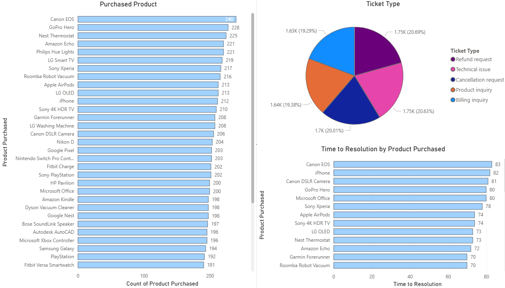

Project Overview

This project includes SQL scripts used for data exploration, cleaning, transformation, and business analysis of the IT support ticket dataset. 
The SQL workflows simulate real-world data analyst tasks commonly performed in relational database environments.
This project also contains an interactive IT Support Analytics Dashboard built in Power BI.
It analyzes support tickets to provide insights into customer issues, resolution performance, ticket trends, and operational efficiency.

SQL Analysis

The SQL scripts include the following queries:

Top_5_prioroty_tickets.sql |
customer_age.sql |
customer_satisfaction.sql |
efficiency_score.sql |
email_chat_phone.sql |
satisfaction_vs_resolution_speed.sql |
ticket_type.sql |
time_resolution.sql |
total_tickets.sql

Dashboard Overview 

Product Insights

Objectives

Monitor IT support ticket performance |
Analyze ticket resolution speed and SLA performance |
Understand customer behavior and demographics |
Identify most common issues and product-related problems |
Improve operational efficiency through data insights

Dataset Description

The dataset contains IT support ticket records with the following fields:

Ticket ID,
Customer Name,
Customer Email,
Customer Age,
Customer Gender,
Product Purchased,
Date of Purchase,
Ticket Type,
Ticket Subject,
Ticket Description,
Ticket Status,
Resolution,
Ticket Priority,
Ticket Channel,
First Response Time,
Time to Resolution,
Customer Satisfaction Rating.

Key KPIs

The dashboard includes the following key performance indicators:
Total Tickets,
Resolved Tickets,
Open Tickets,
Average Resolution Time,
Average First Response Time,
Customer Satisfaction Rating,
Dashboard Pages,
Overview Dashboard,
KPI summary cards,
Ticket status distribution,
Ticket priority analysis,
Ticket trends over time,
Channel distribution,
Customer Insights,
Customer age distribution,
Gender analysis,
Customer activity overview,
High-frequency customers,
Product & Issue Analysis,
Top products causing tickets,
Most common issues,
Resolution time per product,
Channel efficiency comparison,
High priority ticket trends,

Key Business Insights

1. Support Volume Distribution
- The dataset contains **8,469 support tickets**, with **2,769 resolved tickets**.
- Ticket distribution is relatively balanced across categories, with the highest volume coming from:
  - Refund requests (1.75K tickets)
  - Technical issues (1.75K tickets)
  - Cancellation requests (1.70K tickets)
- These categories represent the biggest opportunities for process optimization and automation.

2. Main Support Drivers
- The most common ticket subjects are:
  - Refund requests (576)
  - Software bugs (574)
  - Product compatibility issues (567)
  - Delivery problems (561)
- These areas generate the highest operational workload and should be prioritized for improvement.

3. Ticket Priority Analysis
- Ticket priorities are evenly distributed:
  - Medium: 2.19K
  - Critical: 2.13K
  - High: 2.08K
  - Low: 2.06K
- The high number of critical and high-priority tickets indicates the need for effective prioritization and faster resolution processes.

4. Support Channel Analysis
- Ticket volume is distributed across all channels:
  - Email: 2,143 tickets
  - Phone: 2,132 tickets
  - Social Media: 2,121 tickets
  - Chat: 2,073 tickets
- No single channel dominates, suggesting an opportunity to optimize channel strategy based on resolution efficiency and customer experience.

5. Product Support Insights
- Products with the highest number of related tickets include:
  - Canon EOS (240)
  - GoPro Hero (228)
  - Nest Thermostat (225)
- These products require further investigation to identify recurring issues and potential product improvements.

6. Resolution Time Analysis
- Resolution time varies significantly between products.
- Products such as Canon EOS, iPhone, and Canon DSLR Camera show the highest resolution times.
- Further analysis can help identify root causes and reduce support effort.

Recommendations
- Automate repetitive requests such as refund and technical support cases.
- Improve product documentation for frequently reported issues.
- Prioritize investigation of products with high ticket volume and longer resolution times.

IT-Support-Analytics-Dashboard/
│
├── DATA/              # Raw Excel dataset
├── SQL/               # SQL scripts for analysis & transformations
├── dashboard/         # Power BI dashboard (.pbix)
├── screenshots/       # Dashboard preview images
└── README.md

Tools Used

VSCode |
SQlite |
Power BI Desktop |
Microsoft Excel (Data Source) |
DAX (Data Modeling & Calculations) |
Data Cleaning (Power Query)

Autor:

Metodi Metodiev |
BI & Data Engeneer
