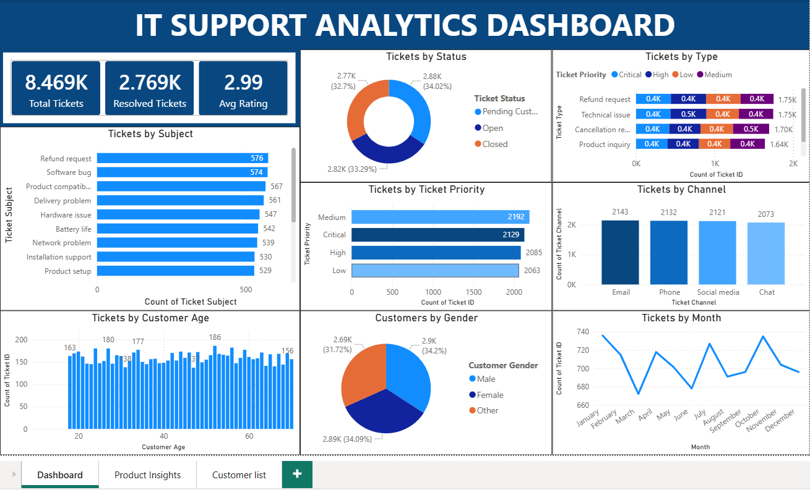

Project Overview

This project includes SQL scripts used for data exploration, cleaning, transformation, and business analysis of the IT support ticket dataset. 
The SQL workflows simulate real-world data analyst tasks commonly performed in relational database environments.
This project also contains an interactive IT Support Analytics Dashboard built in Power BI.
It analyzes support tickets to provide insights into customer issues, resolution performance, ticket trends, and operational efficiency.

SQL Analysis

The SQL scripts include the following queries:

Top_5_prioroty_tickets.sql |
customer_age.sql |
customer_satisfaction.sql |
efficiency_score.sql |
email_chat_phone.sql |
satisfaction_vs_resolution_speed.sql |
ticket_type.sql |
time_resolution.sql |
total_tickets.sql

Dashboard Overview 

Product Insights

Objectives

Monitor IT support ticket performance |
Analyze ticket resolution speed and SLA performance |
Understand customer behavior and demographics |
Identify most common issues and product-related problems |
Improve operational efficiency through data insights

Dataset Description

The dataset contains IT support ticket records with the following fields:

Ticket ID,
Customer Name,
Customer Email,
Customer Age,
Customer Gender,
Product Purchased,
Date of Purchase,
Ticket Type,
Ticket Subject,
Ticket Description,
Ticket Status,
Resolution,
Ticket Priority,
Ticket Channel,
First Response Time,
Time to Resolution,
Customer Satisfaction Rating.

Key KPIs

The dashboard includes the following key performance indicators:
Total Tickets,
Resolved Tickets,
Open Tickets,
Average Resolution Time,
Average First Response Time,
Customer Satisfaction Rating,
Dashboard Pages,
Overview Dashboard,
KPI summary cards,
Ticket status distribution,
Ticket priority analysis,
Ticket trends over time,
Channel distribution,
Customer Insights,
Customer age distribution,
Gender analysis,
Customer activity overview,
High-frequency customers,
Product & Issue Analysis,
Top products causing tickets,
Most common issues,
Resolution time per product,
Channel efficiency comparison,
High priority ticket trends,

Key Insights

Email is the most used support channel |
Certain products generate more support requests |
The most tickets are requests for refund and technical issues |

IT-Support-Analytics-Dashboard/
│
├── DATA/              # Raw Excel dataset
├── SQL/               # SQL scripts for analysis & transformations
├── dashboard/         # Power BI dashboard (.pbix)
├── screenshots/       # Dashboard preview images
└── README.md

Tools Used

VSCode |
SQlite |
Power BI Desktop |
Microsoft Excel (Data Source) |
DAX (Data Modeling & Calculations) |
Data Cleaning (Power Query)

Autor:

Metodi Metodiev |
BI & Data Engeneer
